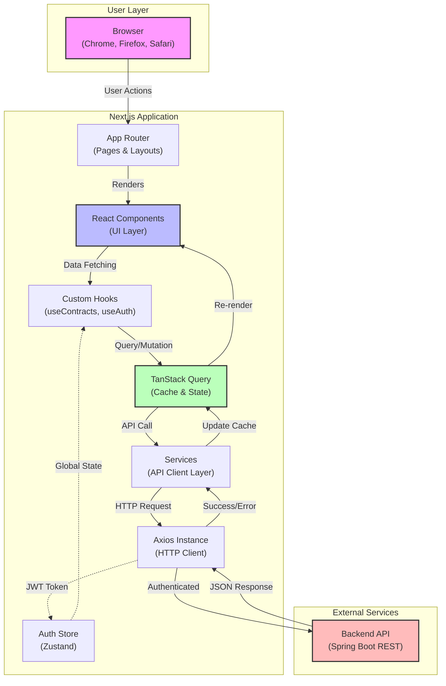
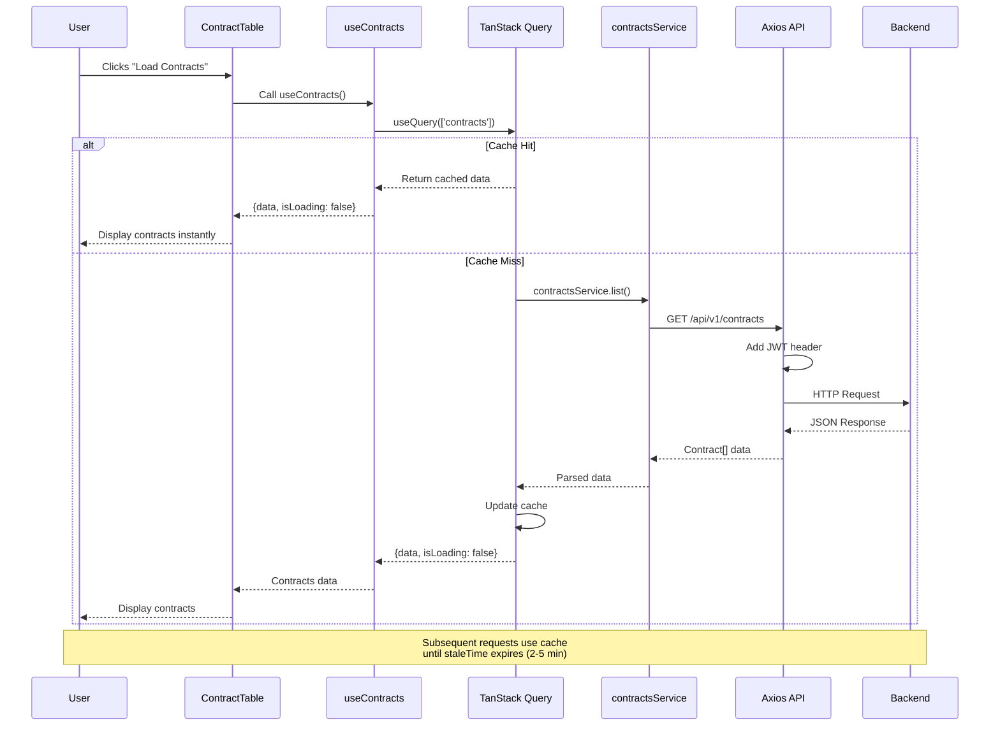
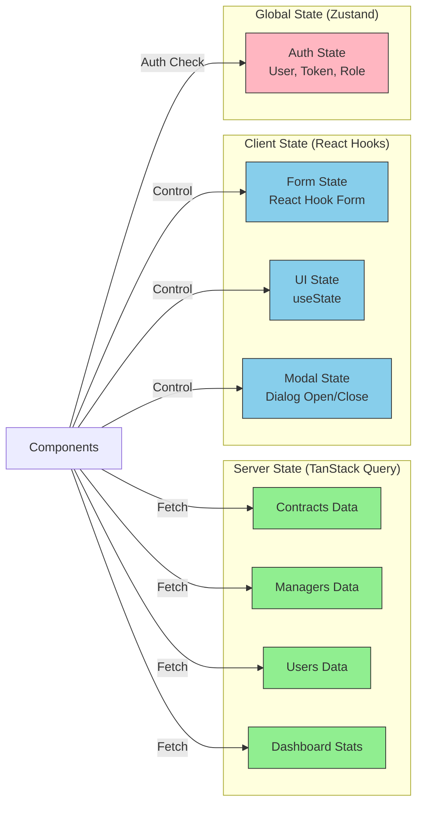

# 🖥️ BCM v2.0 - Frontend

> Modern React/Next.js dashboard for contract lifecycle management with real-time analytics and comprehensive CRUD operations

[](https://nextjs.org/)
[](https://react.dev/)
[](https://www.typescriptlang.org/)
[](https://tailwindcss.com/)
[](./LICENSE)

## 🎯 Overview

BCM v2.0 Frontend is the client application for the Business Contracts Manager system, built with modern React practices and Next.js App Router. This represents the second iteration of my BCM project, showcasing professional TypeScript development, comprehensive form validation, optimized data fetching, and production-ready UX patterns.

**Project Type:** Portfolio Project | Full-Stack SaaS Frontend  
**Status:** Active Development  
**Author:** Donato Corbacio  
**Contact:** donatocorbacio92@gmail.com

---

## ✨ Key Features

### Contract Management UI
- Full CRUD operations with validated forms
- Advanced search with multi-field filtering
- Status-based filtering (ACTIVE, EXPIRED, CANCELLED)
- Real-time data updates with optimistic UI
- Delete confirmation dialogs

### Dashboard & Analytics
- Real-time KPI cards (Total, Active, Expiring, Expired)
- Dynamic data fetching from backend API
- Loading states with skeleton loaders
- Error handling with user feedback

### User Experience
- **Search & Filters** on all data tables
- **Skeleton Loaders** for perceived performance
- **Toast Notifications** for all operations
- **Form Validation** with detailed error messages
- **Responsive Design** for all screen sizes
- **Dark Mode Ready** (prepared for future implementation)

### Security & Authentication
- JWT-based authentication with HTTP-only cookies
- Automatic token refresh
- Auto-redirect on 401 (unauthorized)
- Secure cookie flags in production
- HTTPS enforcement in production environment

### Code Quality
- **100% TypeScript** - Full type safety
- **Zod Validation** - Runtime type checking
- **Clean Architecture** - Services → Hooks → Components
- **Centralized API Client** - Axios with interceptors
- **Query Caching** - TanStack Query optimization

---

## 🏗️ Architecture

### System Overview



### Clean Architecture Pattern

```
┌─────────────────────────────────────────────────┐
│                    Pages                        │
│          (app/(dashboard)/*/page.tsx)           │
│  - Route handling                               │
│  - Layout composition                           │
└──────────────────┬──────────────────────────────┘
                   │
┌──────────────────▼──────────────────────────────┐
│                Components                       │
│         (components/**/*)                       │
│  - UI presentation                              │
│  - User interactions                            │
│  - Form handling                                │
└──────────────────┬──────────────────────────────┘
                   │
┌──────────────────▼──────────────────────────────┐
│            Custom Hooks                         │
│              (hooks/*)                          │
│  - TanStack Query integration                   │
│  - Data fetching logic                          │
│  - Cache management                             │
└──────────────────┬──────────────────────────────┘
                   │
┌──────────────────▼──────────────────────────────┐
│               Services                          │
│            (services/*)                         │
│  - API calls                                    │
│  - Request/Response mapping                     │
│  - Business logic                               │
└──────────────────┬──────────────────────────────┘
                   │
┌──────────────────▼──────────────────────────────┐
│              API Layer                          │
│             (lib/api.ts)                        │
│  - Axios configuration                          │
│  - JWT interceptors                             │
│  - Error handling                               │
└─────────────────────────────────────────────────┘
```

**Key Principles:**
- **Component Isolation:** Components don't call APIs directly
- **Single Source of Truth:** TanStack Query manages server state
- **Type Safety:** TypeScript + Zod for runtime validation
- **Optimistic Updates:** UI updates before server confirmation
- **Error Boundaries:** Graceful error handling at each layer

### Data Flow Example



### State Management Strategy



**State Management Rules:**
1. **Server Data** → TanStack Query (contracts, managers, etc.)
2. **Form Data** → React Hook Form (controlled inputs)
3. **UI State** → Local useState (modals, dropdowns)
4. **Global Auth** → Zustand (user session)

### Technology Stack

**Frontend Framework:**
- Next.js 16.1.1 (App Router)
- React 19 (latest features)
- TypeScript 5

**State Management:**
- TanStack Query 5 (server state, caching)
- Zustand 5 (global auth state)

**Forms & Validation:**
- React Hook Form 7
- Zod 4 (TypeScript-first validation)
- @hookform/resolvers

**UI Components:**
- Radix UI (accessible primitives)
- Tailwind CSS 4 (utility-first styling)
- Lucide React (icons)
- Sonner (toast notifications)

**HTTP & API:**
- Axios (HTTP client)
- js-cookie (cookie management)

---

## 📊 Features Overview

| Feature                | Status | Description                                    |
| ---------------------- | ------ | ---------------------------------------------- |
| **Authentication**     | ✅     | JWT with HTTP-only cookies                     |
| **Dashboard**          | ✅     | Real-time KPIs and analytics                   |
| **Contracts CRUD**     | ✅     | Full lifecycle management                      |
| **Managers CRUD**      | ✅     | Department heads management                    |
| **Users CRUD**         | ✅     | User accounts with roles                       |
| **Business Areas**     | ✅     | Organizational structure                       |
| **Financial Values**   | ✅     | Monthly financial tracking                     |
| **Search & Filters**   | ✅     | All tables with advanced filtering            |
| **Skeleton Loaders**   | ✅     | Smooth loading animations                      |
| **Form Validation**    | ✅     | Comprehensive Zod schemas                      |
| **Toast Notifications**| ✅     | Real-time user feedback                        |
| **Dark Mode**          | ⏳     | Prepared (future implementation)               |
| **Pagination**         | ⏳     | Planned for large datasets                     |
| **Column Sorting**     | ⏳     | Planned for tables                             |

---

## 🗂️ Project Structure

```
bcm-v2-frontend/
├── app/                          # Next.js App Router
│   ├── (auth)/                   # Authentication layout
│   │   └── login/                # Login page
│   ├── (dashboard)/              # Protected dashboard layout
│   │   ├── dashboard/            # Analytics dashboard
│   │   ├── contracts/            # Contracts CRUD
│   │   ├── managers/             # Managers CRUD
│   │   ├── users/                # Users CRUD
│   │   ├── business-areas/       # Business areas CRUD
│   │   └── financial-values/     # Financial values CRUD
│   ├── layout.tsx                # Root layout with providers
│   └── globals.css               # Global styles
│
├── components/                   # React components
│   ├── contracts/                # Contract-specific components
│   │   ├── ContractForm.tsx      # Create/Edit form
│   │   └── ContractTable.tsx     # Data table with actions
│   ├── managers/                 # Manager components
│   ├── users/                    # User components
│   ├── business-areas/           # Business area components
│   ├── financial-values/         # Financial value components
│   ├── dashboard/                # Dashboard components
│   │   └── KPICard.tsx           # Reusable KPI card
│   ├── layout/                   # Layout components
│   │   ├── Header.tsx            # Top navigation bar
│   │   └── Sidebar.tsx           # Side navigation menu
│   └── ui/                       # Reusable UI primitives
│       ├── button.tsx            # Button component
│       ├── dialog.tsx            # Modal dialog
│       ├── input.tsx             # Input field
│       ├── select.tsx            # Dropdown select
│       ├── table.tsx             # Data table
│       ├── checkbox.tsx          # Checkbox input
│       ├── textarea.tsx          # Textarea input
│       └── table-skeleton.tsx    # Loading skeleton
│
├── services/                     # API service layer
│   ├── contracts.service.ts      # Contract API calls
│   ├── managers.service.ts       # Manager API calls
│   ├── users.service.ts          # User API calls
│   ├── businessAreas.service.ts  # Business area API calls
│   ├── financialValues.service.ts # Financial value API calls
│   ├── roles.service.ts          # Roles reference data
│   └── dashboard.service.ts      # Dashboard stats API
│
├── hooks/                        # Custom React hooks
│   ├── queries/                  # Query key organization
│   │   ├── contracts.queryKeys.ts
│   │   └── reference.queryKeys.ts
│   ├── useContracts.ts           # Fetch contracts
│   ├── useUpsertContract.ts      # Create/Update contract
│   ├── useManagers.ts            # Fetch managers
│   ├── useUpsertManager.ts       # Create/Update manager
│   ├── useUsers.ts               # Fetch users
│   ├── useUpsertUser.ts          # Create/Update user
│   ├── useBusinessAreas.ts       # Fetch business areas
│   ├── useUpsertBusinessArea.ts  # Create/Update business area
│   ├── useFinancialValues.ts     # Fetch financial values
│   ├── useUpsertFinancialValue.ts # Create/Update financial value
│   ├── useRoles.ts               # Fetch roles (reference)
│   ├── useAuth.ts                # Authentication hook
│   └── useDashboardStats.ts      # Dashboard statistics
│
├── lib/                          # Utilities and config
│   ├── api.ts                    # Axios instance with interceptors
│   ├── utils.ts                  # Helper functions
│   └── validations/              # Zod schemas
│       ├── contract.schema.ts    # Contract validation
│       ├── manager.schema.ts     # Manager validation
│       ├── user.schema.ts        # User validation (create/update)
│       ├── businessArea.schema.ts # Business area validation
│       └── financialValue.schema.ts # Financial value validation
│
├── store/                        # Global state
│   └── authStore.ts              # Authentication state (Zustand)
│
├── types/                        # TypeScript definitions
│   └── index.ts                  # Shared types and interfaces
│
└── providers/                    # React context providers
    └── ReactQueryProvider.tsx    # TanStack Query setup
```

---

## 🛠️ Setup Instructions

### Prerequisites

- **Node.js 20+** (LTS recommended)
- **npm/pnpm/yarn**
- **Backend API** running at `http://localhost:8090` (or configured URL)

### 1. Clone Repository

```bash
git clone https://github.com/DonatoCorbacioDev/bcm-v2.git
cd bcm-v2/bcm-v2-frontend
```

### 2. Install Dependencies

```bash
npm install
# or
pnpm install
# or
yarn install
```

### 3. Environment Configuration

Create `.env.local` file in the project root:

```bash
# Backend API URL
NEXT_PUBLIC_API_URL=http://localhost:8090/api/v1
```

**Production Example:**

```bash
NEXT_PUBLIC_API_URL=https://your-backend-api.com/api/v1
```

### 4. Start Development Server

```bash
npm run dev
# or
pnpm dev
# or
yarn dev
```

The application will start at: `http://localhost:3000`

### 5. Build for Production

```bash
# Create optimized production build
npm run build

# Start production server
npm start
```

---

## 🔐 Authentication Flow

```
1. User submits credentials → POST /api/v1/auth/login
2. Backend validates → Returns { token, user }
3. Frontend stores token in HTTP-only cookie
4. All subsequent requests include: Authorization: Bearer <token>
5. On 401 response → Clear auth state → Redirect to /login
```

### Cookie Configuration

```typescript
Cookies.set("auth_token", token, {
  expires: 7,                              // 7 days
  secure: process.env.NODE_ENV === "production",  // HTTPS only in prod
  sameSite: "strict",                      // CSRF protection
});
```

---

## 📊 Data Flow Example

### Example: Fetching Contracts

```typescript
// 1. Page component renders
<ContractsPage />

// 2. Calls custom hook
const { data, isLoading } = useContracts();

// 3. Hook uses TanStack Query
useQuery({
  queryKey: contractsQueryKeys.list(),
  queryFn: contractsService.list,
  staleTime: 2 * 60 * 1000,  // Cache for 2 minutes
});

// 4. Service makes API call
const res = await api.get<Contract[]>("/contracts");

// 5. Axios interceptor adds JWT automatically
config.headers.Authorization = `Bearer ${token}`;

// 6. Data flows back: API → Service → Hook → Component
```

---

## ✅ Form Validation

### Example: Contract Schema

```typescript
// Zod schema with cross-field validation
const contractSchema = z.object({
  contractNumber: z.string().min(3).max(50),
  customerName: z.string().min(2).max(100),
  startDate: z.string().regex(/^\d{4}-\d{2}-\d{2}$/),
  endDate: z.string().regex(/^\d{4}-\d{2}-\d{2}$/),
  status: z.enum(["ACTIVE", "EXPIRED", "CANCELLED"]),
}).refine(
  (data) => new Date(data.endDate) >= new Date(data.startDate),
  { message: "End date must be after start date", path: ["endDate"] }
);

// React Hook Form integration
const form = useForm<ContractFormData>({
  resolver: zodResolver(contractSchema),
});

// Automatic error display
{errors.contractNumber && <p>{errors.contractNumber.message}</p>}
```

---

## 🔍 Search & Filters Implementation

### Example: Contract Table

```typescript
function useContractFilters(contracts: Contract[]) {
  const [searchQuery, setSearchQuery] = useState("");
  const [statusFilter, setStatusFilter] = useState<string>("ALL");

  const filteredContracts = useMemo(() => {
    return contracts.filter((contract) => {
      const matchesSearch =
        searchQuery === "" ||
        contract.customerName.toLowerCase().includes(searchQuery.toLowerCase()) ||
        contract.contractNumber.toLowerCase().includes(searchQuery.toLowerCase());

      const matchesStatus =
        statusFilter === "ALL" || contract.status === statusFilter;

      return matchesSearch && matchesStatus;
    });
  }, [contracts, searchQuery, statusFilter]);

  return { searchQuery, setSearchQuery, statusFilter, setStatusFilter, filteredContracts };
}
```

**Features:**
- Client-side filtering (instant feedback)
- useMemo optimization (prevents unnecessary re-renders)
- Multi-field search
- Combinable filters
- Results counter

---

## 🧪 Testing

```bash
# Run ESLint
npm run lint

# Type check
npx tsc --noEmit

# (Future) Unit tests
npm test
```

---

## 🚀 Deployment

### Vercel (Recommended)

```bash
# Install Vercel CLI
npm i -g vercel

# Deploy to production
vercel --prod

# Set environment variable in Vercel dashboard:
# NEXT_PUBLIC_API_URL=https://your-backend-api.com/api/v1
```

### Docker (Alternative)

```dockerfile
FROM node:20-alpine
WORKDIR /app
COPY package*.json ./
RUN npm ci --only=production
COPY . .
RUN npm run build
EXPOSE 3000
CMD ["npm", "start"]
```

```bash
docker build -t bcm-frontend:1.0.0 .
docker run -p 3000:3000 -e NEXT_PUBLIC_API_URL=https://api.example.com bcm-frontend:1.0.0
```

---

## 📝 Key Design Decisions

### 1. Separation of Concerns
- **Services** handle API communication
- **Hooks** manage React Query state
- **Components** focus on UI presentation
- **Validations** centralized in Zod schemas

### 2. Type Safety
- Full TypeScript coverage
- Zod for runtime validation
- Type inference from schemas (`z.infer<typeof schema>`)
- No `any` types

### 3. Performance Optimization
- TanStack Query caching (2-5min staleTime)
- useMemo for expensive filters
- Skeleton loaders for perceived speed
- Optimistic UI updates

### 4. Security
- JWT in HTTP-only cookies (XSS protection)
- Secure flag in production (HTTPS only)
- SameSite strict (CSRF protection)
- Automatic 401 handling
- HTTPS enforcement in production

### 5. User Experience
- Toast notifications for all operations
- Loading states everywhere
- Confirmation dialogs for destructive actions
- Detailed validation errors
- Empty states with guidance

---

## 🐛 Known Limitations & Future Improvements

### Current Limitations

- No pagination (client-side filtering only)
- No column sorting (click to sort)
- No bulk operations (select multiple + action)
- No export functionality (CSV/Excel)
- No real-time updates (WebSocket)

### Planned Improvements

- [ ] Add pagination for large datasets
- [ ] Implement column sorting
- [ ] Add bulk delete/update operations
- [ ] Export to CSV/Excel
- [ ] Dark mode implementation
- [ ] Real-time notifications (WebSocket)
- [ ] Offline support (PWA)
- [ ] Unit tests (React Testing Library)
- [ ] E2E tests (Playwright/Cypress)
- [ ] Accessibility audit (WCAG 2.1)
- [ ] Performance optimization (Lighthouse 95+)
- [ ] i18n support (multiple languages)

---

## 👨‍💻 About the Developer

**Donato Corbacio**

- 🎓 Bachelor's Degree in Computer Science and Software Production Technologies (Dec 2024)
- 💼 Full-Stack Developer seeking opportunities
- 📚 Currently studying: Python IFTS & AI Automation Business
- 🌍 Based in Puglia, Italy
- 💡 Passionate about clean code, modern architecture, and continuous learning

### Contact & Links

- 📧 Email: donatocorbacio92@gmail.com
- 💼 LinkedIn: [linkedin.com/in/donato-corbacio](https://www.linkedin.com/in/donato-corbacio/)
- 🐱 GitHub: [@DonatoCorbacioDev](https://github.com/DonatoCorbacioDev)
- 🌐 Portfolio: [Coming Soon]

---

## 📄 License

This project is licensed under a **Custom Non-Commercial License** - see the [LICENSE](./LICENSE) file for full details.

**Summary:**

- ✅ Code available for educational purposes and review
- ✅ May be used for learning and portfolio demonstration
- ❌ Commercial use prohibited without explicit permission
- ❌ Cannot be sold or offered as SaaS without authorization

For commercial licensing inquiries: donatocorbacio92@gmail.com

---

## ⚠️ Disclaimer

This is a **portfolio/demonstration project** showcasing modern React/Next.js development practices.

**Important Notes:**

- This repository contains NO sensitive data (all dummy/example data)
- Configuration uses environment variables (`.env.local` git-ignored)
- Not intended for production use without proper security audit
- Cookie flags and HTTPS enforcement configured for production

**Before production deployment:**

- Perform comprehensive security review
- Conduct accessibility audit (WCAG 2.1)
- Test across multiple browsers and devices
- Set up proper monitoring and error tracking (Sentry, LogRocket)
- Implement rate limiting (external service)
- Configure CDN for static assets
- Enable analytics (privacy-respecting)

---

## 🙏 Acknowledgments

Built with modern technologies and best practices from:

- Next.js and Vercel team
- React and Meta engineers
- TanStack team (React Query)
- Radix UI contributors
- Tailwind CSS team
- Open-source community worldwide

Special thanks to all library maintainers and contributors.

---

## 🔗 Related Projects

- **BCM Backend v2.0**: Spring Boot 3.5.9 + Java 21 REST API with 100% test coverage
- **BCM v1.0** (Thesis Project): Angular-based original version

---

**⭐ If you're a recruiter or technical reviewer**, feel free to explore the codebase. This project demonstrates:

- Modern React/TypeScript development
- Clean Architecture principles
- Production-ready UX patterns
- Comprehensive form validation
- Security best practices
- Performance optimization

**💬 Open to feedback and collaboration opportunities!**

For questions or to discuss this project in detail, please reach out via email or LinkedIn.
